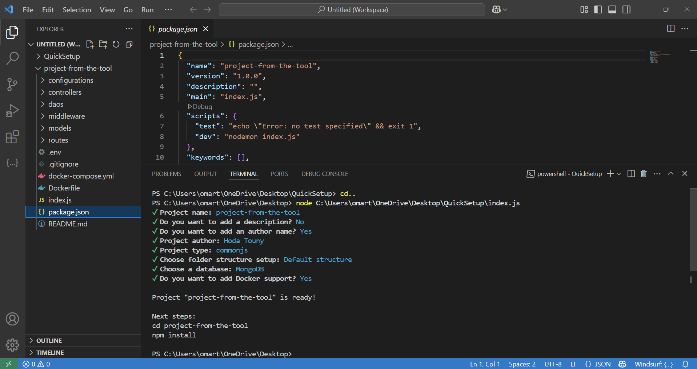

# QuickSetup

**QuickSetup** is a powerful and flexible CLI tool that scaffolds a fully functional Node.js backend project using Express.  
It provides a clean project structure, supports multiple databases, and comes with optional Docker integration for containerized environments.

---

## Features

- Generates modular project structure:
  - `routes`, `controllers`, `models`, `middleware`, `dao`, `configurations`
- Supports both CommonJS and ES Module
- Integrated database configuration:
  - MongoDB (via Mongoose)
  - PostgreSQL (via Sequelize)
  - MySQL (via Sequelize)
- Docker & docker-compose support
- Auto-generates essential files:
  - `package.json`, `.env`, `.gitignore`, `README.md`, and more

## Installation

```bash
git clone https://github.com/your-username/quicksetup.git
cd quicksetup
npm install
```

---

## Getting Started

### Step 1: Run the CLI

```bash
node index.js
```

### Step 2: Answer the prompts

```text
Project name: project-from-the-tool
Add a description? (No)
Add an author name? (Yes)
Project author: Hoda Touny
Project type: commonjs
Select folder structure: Default
Choose a database: MongoDB
Enable Docker support? (Yes)
```
---

## Generated Structure

```bash
my-app/
├── configurations/
│   └── dbConfig.js
├── controllers/
├── daos/
├── middleware/
├── models/
├── routes/
├── .env
├── .gitignore
├── Dockerfile
├── docker-compose.yml
├── index.js
├── package.json
└── README.md
```

---

## Scripts

```bash
npm install     # Install dependencies
npm run dev     # Start development server with nodemon
```

---

## Environment Variables

Ensure the `.env` file includes the following:
```env
PORT=5000
DB_URL=your_connection_string
```

---

## Preview


